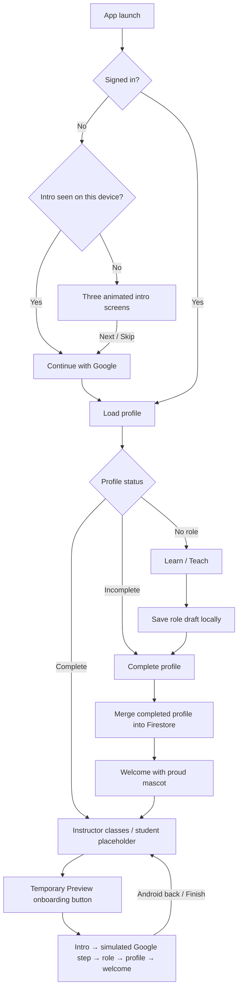
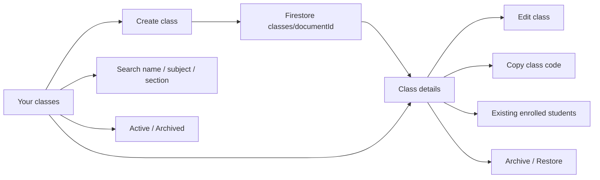

# Filo - Agent Handoff

Last updated: 2026-09-30

## Read this first

Filo is a Flutter mini LMS for **students** and **instructors**. The user is
building the instructor class-management side after refining onboarding on a real Android phone.

**Current user instruction: do not run tests, static analysis, builds, browser
checks, or automated device checks unless the user explicitly asks. The user will
test personally and wants to minimize token/tool costs.** Do not start extra agents.
Make focused changes and report what was edited without claiming it was tested.

## Product decisions

- Inspired by the ideas behind Classroom, Drive, Forms, and NotebookLM; not copies.
- Playful, encouraging UI/UX inspired by Duolingo, with Filo's own visual identity.
- Minimal copy: short headlines, one short supporting sentence, clear actions.
- Let the character, color, and animation convey personality. Avoid redundant
  taglines, reassurance paragraphs, decorative captions, and floating text cards.
- Google login only. No email/password registration or login screens.
- First-time users choose Student or Instructor, then complete their profile.
- A class code is not required to create an account or finish onboarding.
- Independent study and AI grounded in learning materials are planned features.

## Current flow



Preview mode uses the signed-in user's identity in memory. It does not invoke
Google sign-in, update Firestore, alter local onboarding preferences, or change
the real saved profile. Android Back or completing the preview returns to the original dashboard. The temporary
button is intentionally present for visual review and should be removed before
shipping unless the user decides otherwise.

The user asked to remove the visible “Preview only / Nothing is saved” message.
The message and all preview Exit buttons have been removed. Android Back and
finishing the preview still restore the dashboard; data isolation remains.

## Implemented screens

1. Intro: “Learning, together.” / “Small steps. Big wins.” / “Stay curious.”
2. Login: “Hello, curious mind.” and Continue with Google.
3. Role: “I am here to...” with Learn (student) and Teach (instructor).
4. Profile: Google-prefilled display name, read-only Google email, optional school
   and bio; selectable illustrated avatar or existing Google photo.
5. Welcome: personalized greeting and “Let's go”.
6. Instructor dashboard: live class cards, search, Active/Archived filters, create
   class, and temporary onboarding preview. Student dashboard remains a placeholder.
7. Class editor: name, subject, section, description, cover color; fixed save button.
8. Class details: saved metadata, copyable class code, enrolled students, edit,
   and archive/restore via the class options menu.

Profile photo upload, student class joining, learning resources, submissions,
assessments, and AI are **not implemented**. Class creation, editing, archive/restore,
listing, and viewing existing enrollment records are implemented. Copying a class
code does not implement student redemption; student joining is the next separate flow.

## Mascot and design

The mascot is an original folded-file character drawn directly with Flutter
`CustomPainter`, not a downloaded image or a Duolingo character. It has a lime
paper body, folded corner, teal limbs, peach cheeks, two document lines, and a
small teal bookmark. No mascot name has been finalized with the user.

`MascotExpression` provides:

| Expression | Current use |
| --- | --- |
| friendly | Intro 1 / default |
| excited | Intro 2 |
| curious | Intro 3 / profile desktop art |
| wink | Google login |
| proud | Onboarding completion |

`LearningArt(scene: ...)` retains compatibility with existing callers. An explicit
`expression: MascotExpression...` overrides the scene mapping. The mascot gently
bobs and waves; system reduced-motion preferences stop the animation. Decorative
art is excluded from screen-reader semantics. Floating text cards were removed. The mascot widget fills the available width
and centers its artwork horizontally across onboarding screens.

Palette and typography live in `design.dart`: cream background, deep teal controls,
soft mint panels, lime accents, and bundled Nunito. Keep rounded shapes, generous
spacing, readable contrast, and simple tap targets. Desktop uses a split layout;
mobile uses a scrollable single column. FiloFrame has an optional fixed `footer`;
the intro uses it to keep Next/Get started at the same position on every slide.

## Code map

| File | Responsibility |
| --- | --- |
| `lib/main.dart` | Firebase startup, app theme, flow routing, transitions, preview Android Back handling |
| `lib/onboarding/screens.dart` | Intro, login, role, profile, welcome, and dashboard UI |
| `lib/onboarding/illustrations.dart` | Mascot expressions, drawing, animation, responsive FiloFrame |
| `lib/onboarding/design.dart` | Theme, colors, brand, buttons, progress, errors, avatars |
| `lib/onboarding/onboarding_repository.dart` | Firebase integration, models, onboarding state machine, isolated preview mode |
| `lib/firebase_options.dart` | FlutterFire-generated platform configuration |
| `test/widget_test.dart` | Existing flow/layout/preview tests; do not run unless requested |
| `assets/fonts/` | Nunito font and open-source license |
| `README.md` | Run instructions and platform notes |
| `lib/classes/class_repository.dart` | Firestore class models, owner-filtered streams, writes, roster reads |
| `lib/classes/instructor_dashboard.dart` | Instructor classes, search, Active/Archived filters, create action |
| `lib/classes/class_editor.dart` | Create/edit form and shared class cover colors/icons |
| `lib/classes/class_detail_screen.dart` | Live class details, copy code, roster, edit/archive/restore |
| `firebase/firestore.rules` | Current class-management Firestore rules source |
| `firebase/firestore.rules.before-class-management` | Backup of remote rules before the scoped owner-read addition |

## Firebase and persistence

- Project: `filo-app-1a2a5`.
- Google authentication was confirmed enabled; localhost is an authorized domain.
- Existing default Firestore database is in `asia-southeast1`.
- Completed profiles are stored in `users/{uid}` using a merge write to preserve
  unrelated fields. Fields: role, name, school, bio, avatar, complete, updatedAt.
- Existing profile displayName is accepted as a fallback for name.
- Avatar -1 uses the Google photo if available; 0–3 choose illustrated avatars.
- Intro preference: `filo.intro.v1` in SharedPreferences.
- Role drafts: `filo.profileDraft.<uid>` locally. Drafts resume on the same device;
  completed profiles resume across devices. Unsubmitted profile field edits are
  not autosaved on every keystroke.
- Firestore rules are now tracked locally. The class-management update adds a
  direct `resource.data.instructorId == request.auth.uid` read alternative for
  owner-filtered list queries, preserving the previous membership authorization
  and all other rules. Existing user roles are immutable after being saved server-side. `roleLocked`
  prevents showing the profile back action for a loaded server-side role.
- Existing rules allow signed-in users to read user documents. They are not a
  complete reviewed privacy/security design for the eventual LMS. Review them
  with the actual class/enrollment design before production; do not replace
  existing rules casually while adjusting onboarding UI.
- Preview profile choices remain in memory and restore the original profile on exit.


## Instructor class management



- Instructor route: HomeScreen detects `profile.role == 'instructor'` and shows
  InstructorDashboard. The existing isolated onboarding preview remains available.
- Documents: `classes/{id}` with instructorId, name, subject, section, description,
  color (0-3), archived, createdAt, updatedAt. Old title fields are read as a fallback.
- List query filters by instructorId only; sorting, archive filtering, and text
  search happen locally. No new composite index is required.
- Class codes are the existing unique, case-sensitive Firestore document IDs.
  They are intentionally longer than an eight-digit code to avoid introducing an
  unprotected code index or collision-prone short code. No public lookup is allowed.
- A future student join operation must validate the code and class state on a
  trusted backend. Do not weaken class reads to make student code lookup work.
- The current roster reads `classes/{id}/enrollments/{studentUid}` and resolves
  display names from users. It does not enroll or remove students.
- Archive is a reversible boolean flag, not deletion. Existing class content and
  enrollment documents are preserved. It currently organizes the instructor UI;
  it does not yet enforce a read-only policy across future activities/materials.
- Create/edit save buttons sit at the bottom. Name is required; other fields are
  optional. Class options live in the detail screen's upper-right menu.
- Save waits are bounded to 20 seconds. Firestore can queue a write offline, so
  timeout copy says the change may complete when reconnected. A form reuses its
  class document ID for retries to avoid creating a duplicate within that form.
- Existing instructor dashboard widget tests still reference the old placeholder;
  when testing is authorized, update their fixture to inject/mock class storage.
  No tests were changed or executed as part of this feature.

## Platforms and local environment

- Workspace: `C:\Codex\Filo`, Windows PowerShell.
- Flutter: `C:\src\flutter\bin\flutter.bat`.
- Android SDK: `C:\Users\Dell\AppData\Local\Android\Sdk`.
- ADB: `C:\Users\Dell\AppData\Local\Android\Sdk\platform-tools\adb.exe`.
- Git initialized on main. No remote or initial commit was created by this agent.
- Google web popup and native Android/iOS/macOS sign-in integration is implemented.
- Android debug SHA-1 for this computer is registered; Google services JSON was
  refreshed. Android release INTERNET permission was added.
- Apple's Google client ID and URL schemes are in Info.plist; macOS network and
  keychain entitlements are configured. Apple builds still require macOS/Xcode.
- Windows native Google login is not implemented; use web on Windows. Linux
  Firebase configuration is not supported in this project yet.

The user's Android phone was paired wirelessly and detected as 24117RN76G on
Android 16. Its last connection address was `192.168.1.2:45673`; addresses/ports
can change. Do not reuse old pairing codes. `adb mdns services` can identify
pairing vs connection ports when the user requests connection help.

To run manually:

```powershell
flutter run -d DEVICE_ID
# or
flutter run -d chrome --web-port 54321
```

Capital `R` in a running Flutter terminal performs a hot restart. Use it after
widget structure/field changes. Ordinary `r` hot reload can reject those changes.
Onboarding introduction can be replayed through the dashboard preview button.

## Latest changes and validation status

Latest request implemented:

- Added the instructor class-management dashboard, create/edit form, class details,
  search, active/archive filters, archive/restore, copyable code, and roster view.
- Google auth, onboarding, minimal copy, color palette, mascot, and preview mode
  remain in place. Student enrollment and course content are separate next steps.
- No Flutter tests, analysis, builds, browser automation, or device checks run.
  The scoped Firestore owner-read rule was deployed successfully to
  `filo-app-1a2a5` on 2026-09-30. No application data or sample classes were created.


- Role selection ("I am here to...") now uses the same fixed FiloFrame footer
  as the intro. Continue stays at the bottom; role cards scroll above it.
  Role selection, disabled/loading states, and save errors are preserved.
  No tests or automated checks run.

- Get started/Skip now transitions from intro to Google login with a 480 ms
  fade and horizontal slide: intro exits left, login enters from the right.
  A cream backdrop and clipping prevent edge flashes. Reduced motion skips
  the animation. No tests or automated checks run.

- Smoothed intro text fade/slide transitions; reserve the tallest slide's copy
  area at the current width/font scale to avoid shifting during transitions.
- Ignore rapid repeated slide taps during the short transition.
- Mascot expression changes crossfade, head tilt eases, bobbing is gentler, and
  animation phase survives inherited layout changes. Shadow remains centered.
- Outgoing screen/slide widgets ignore pointer input and accessibility focus.
- All new motion honors reduced-motion settings. No checks run for this revision.

- Intro Next/Get started now lives in a fixed bottom footer, independent of slide
  copy height. Content remains scrollable on small screens and with enlarged text.

- Centered the mascot horizontally using the shared LearningArt widget.

- Removed the visible preview status message and all preview Exit buttons.
  Preview now uses the same full-height layout as regular onboarding.
- Removed all floating text cards from the mascot artwork.
- Reworked the file mascot with five expressions and expression-specific poses.
- Added this handoff document and a root AGENTS.md pointer for future agents.

**No tests, analysis, builds, or preview checks were run for these latest changes,
per user instruction.** Earlier, before this mascot revision, six tests passed
and Flutter analysis was clean. This is historical evidence only, not validation
of the current edits. The user is responsible for the next manual review.

Screenshots under `artifacts/` are older and may not match the latest UI. Do not
use them as current visual ground truth. Existing test assertions now reflect the removed preview message and buttons;
test execution remains deferred.

## Next-agent checklist

- Read this file, then inspect only the source relevant to the user's request.
- Respect minimal copy and preserve the original mascot identity.
- Do not run checks, spawn agents, or regenerate screenshots unless asked.
- Do not reset onboarding flags, log out the user, or write profile changes merely
  to preview designs; use the existing isolated preview mode.
- Ask only for missing decisions that block the requested change.
- Keep this handoff current when behavior, scope, or important decisions change.
- Report edits concisely and distinguish implemented features from placeholders.
