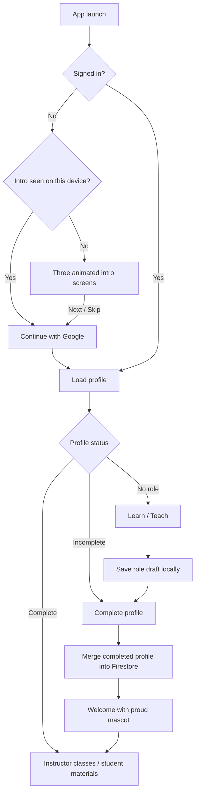
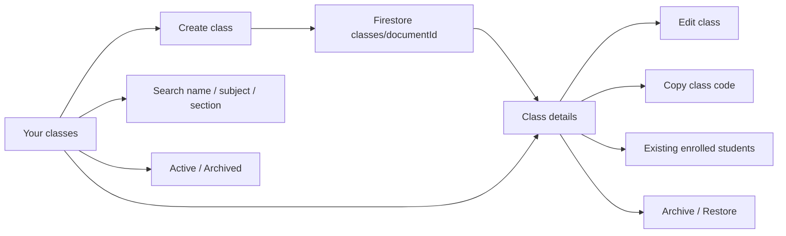

# Filo - Agent Handoff

Last updated: 2026-10-05

## Android signing and member distribution prepared - 2026-10-05

- Created local android/signing/filo-testers.jks and android/key.properties with
  generated password (not printed). Confirmed both are gitignored. Dedicated RSA
  alias filo-testers; preserve/back up BOTH private files, never regenerate for
  updates. Public certificate fingerprints and Firebase steps: ANDROID_SIGNING.md.
- Android release Gradle configuration now loads key.properties and uses release
  signing, with an explicit missing-config error for requested release tasks.
  Debug signing remains separate; no build performed.
- Added .github/workflows/android-testers.yml: manual main-only release, Flutter
  3.47.6/Java17, locked dependency resolution, signed universal APK, increasing
  build number 1000+run_number, 14-day APK artifact, official Firebase CLI upload
  to filo-members using dedicated service account ADC, private file cleanup.
- CI_CD.md documents three GitHub secrets and console setup; clipboard helper
  scripts/copy-signing-secret.ps1 avoids printing signing secret values.
- Pending external setup: fingerprints/refreshed google-services.json, Firebase
  App Distribution/group/members, dedicated distribution service account and
  GitHub secrets, commit/push and first workflow run. No gh CLI available locally.
  No tests/analysis/builds/device checks/workflow execution. Existing backend used,
  not staging; onboarding preview isolation unchanged. CI quality gates not added.

## Onboarding celebration arm correction - 2026-10-05

- Fixed left shoulder tangent interpolation across the +/-pi boundary: normalize
  negative left outgoing angles into the same continuous range. Previously a
  lift could interpolate the long way around and contort the arm between poses.
- Softened excited celebration on "Small steps. Big wins." and other excited
  placements to a smaller two-arm cheer with relaxed return. Original character,
  small body movement and existing randomized eyes preserved.
- Exported 19141-byte bundled asset with zero errors/warnings; transition and
  raised-arm PNGs inspected. No Flutter tests/analysis/builds/device checks.
  Restart app to refresh native asset cache; user reviews live motion manually.

## Varied mascot gestures - 2026-10-05

- Replaced shared waving behavior with expression-specific six-second loops:
  friendly greeting wave, excited two-arm celebration, curious thinking/eye
  glance, proud hand-to-chest acknowledgment, and wink relaxed two-arm stretch.
  Both arms now use anchored path deformation. Existing screen expressions
  select these gestures without changing Flutter placements or onboarding data.
- Preserved randomized eye timing, tiny idle rise/fall and centered tilt below
  one degree. No large body sway or jumps. This supersedes earlier shared-wave
  descriptions below.
- Exported bundled 19146-byte Rive asset with zero errors/warnings. Celebration
  and acknowledgment PNG previews inspected under existing authorization.
  No Flutter builds/tests/analysis/device checks. Restart app to refresh the
  native asset cache; live animation remains for user manual review.

## Natural eye timing and restrained body motion - 2026-10-05

- Wink expression no longer permanently closes one eye: friendly/curious/wink
  eye groups bind scaleY to new MascotData leftEyeOpen/rightEyeOpen numbers,
  exported defaults 1. Removed deterministic timeline blinks. Runtime schedules
  events 2.8–7 seconds apart: usually both-eye blink (130ms), sometimes randomly
  selected single-eye wink (220ms). Restores open eyes, cancels timers when hidden,
  backgrounded/disposed. Excited/proud retain intentional happy-eye artwork.
- Added centered body-motion group to avoid outer top-left pivot. Wave body tilt
  bounded to .012 radians (under 1 degree), returns neutral; idle moves vertically
  only ±0.5 artboard pixels. Existing deforming arm wave remains. Reduced motion
  still uses static painter, with no eye timers.
- Re-exported 15692-byte asset with zero export errors/warnings; open-eye wink
  pose PNG rendered/inspected using existing authorization. Restart app to refresh
  native asset cache/new bindings. No Flutter builds/tests/analysis/device checks;
  randomized live eye timing still for user manual review.

## Arm bending correction - 2026-10-05

- Replaced rigid right-arm rotation with keyed path deformation: shoulder tangent,
  wrist position and wrist tangent change together through relaxed, partly lifted,
  raised and waving poses. Shoulder stays anchored; down arm matches left arm's
  relaxed outward/downward curve. Body stays still; existing six-second timing.
- Generator arm_poses is distinct from expression poses to avoid name collision.
  Final 16548-byte Rive asset exported with zero errors/warnings; rest/lowering
  PNGs rendered and inspected under existing authorization. Restart app for asset
  cache refresh. No Flutter builds/tests/analysis/device checks.

## Simplified arm wave correction - 2026-10-05

- User reported a pinned/top-left sway. Removed body rotation and vertical
  motion from all timelines instead of rotating the artwork around its outer
  origin. Body/feet now stay planted. Left hand stays down; right hand rests
  down, raises, waves twice, lowers and rests on a six-second repeat. Applies to
  friendly/excited/proud/wink; curious keeps its still thinking arm. Removed
  thinking/eye-glance movements; occasional blink and static expressions remain.
- Re-exported 11136-byte asset, zero export errors/warnings. Hand-down and waving
  PNGs rendered/inspected under existing authorization. Restart app to clear
  shared decoded asset cache. No Flutter builds/tests/analysis/device checks.

## More expressive mascot motion - 2026-10-05

- Replaced shared floating idle with five expression-specific six-second motion
  timelines: friendly multi-swing greeting wave; excited two small jumps with arm
  lifts; curious side-to-side glance/tilt and thinking-hand movement; proud double
  nod/hand lift; wink playful sway/wave. Gestures happen early then settle, rather
  than constantly floating. Expressions/motionEnabled public bindings unchanged.
- Tapping a loaded Rive mascot briefly switches to wink (or excited from wink),
  restoring its screen expression after 1.5 seconds. Screen expression changes
  cancel transient reaction; timer disposed with widget. Decorative/nonessential,
  no new text or navigation; original reduced-motion fallback remains still.
- Regenerated script-free asset: 11480 bytes; Rive exports report zero errors and
  warnings. Wave/jump PNG previews rendered and inspected under prior explicit
  Rive export/PNG authorization. No Flutter builds/tests/analysis/device checks.

## Mascot placement rollout - 2026-10-05

- User approved the proposed page/modal placements. LearningArt now defaults to
  Rive everywhere, with explicit useRive:false still available; original painter
  stays the loading/error/reduced-motion fallback. No asset regeneration needed.
- Existing intro/login art uses Rive. Role choice is curious before selection and
  friendly afterward; profile setup friendly, welcome excited. Role/profile get
  one compact illustration on narrow screens; wide FiloFrame already has its art.
- Student dashboard gets the same 96px greeting mascot as instructor (curious
  search, proud enrolled classes, friendly otherwise). Replaced student empty-list
  mascot with a simple icon to avoid doubling it in the greeting/list section.
- Materials Stream/Files and empty Classwork cards use a compact curious mascot.
  Empty notifications uses friendly art only when actually empty, not on loading
  or errors. Existing assessment completion's proud art now uses Rive too.
- Shared showMascotSuccess adds a 56px proud/excited mascot to short three-second
  snackbars after successful class join, new class creation and committed work
  submission. No additional success modal/navigation delay. Submission transaction
  returns a boolean to avoid claiming success when a concurrent submission made
  it a no-op; deadline/storage/grade authorization unchanged.
- AI quiz editor shows curious art + Preparing questions only while generating,
  alongside existing progress indicator. Saves do not show this reaction. No
  mascot added to destructive confirmations, grade forms or error messages.
- No tests, static analysis, app/Rive builds, browser automation or device checks
  run for this placement rollout. Manual runtime/mobile layout review remains.
  Backend, offline sync, notification read-state and preview data isolation retained.

## Rive preparation - 2026-10-05

- Initial implementation completed after user requested plan implementation and
  explicitly authorized Rive export + PNG previews only. Editable mascot project
  is animations/filo_mascot/scene.rml; generate_source.py recreates source geometry
  from original painter (overwrites hand edits). README.md records authoring/API.
- Exported assets/animations/filo_mascot.riv: 7528 bytes, script-free vector shapes,
  FiloMascot artboard / Mascot state machine / MascotData exported Default model.
  expression number 0 friendly, 1 excited, 2 curious, 3 proud, 4 wink; motionEnabled
  boolean. Five poses crossfade over 180ms, curious has a tilt, four-second idle
  loop bobs/blinks and briefly waves per cycle. PNG previews rendered and visually
  inspected for all five poses in artifacts/rive. Final exports report zero errors
  and warnings. No publishing, Rive login or persistent preview window.
- Added rive ^0.14.11, resolved rive 0.14.11 / rive_native 0.1.11 using flutter pub
  get (also updated generated native plugin registrations). Asset registered.
  LearningArt retains scene/compact/expression and adds useRive opt-in. Enabled
  only on instructor dashboard/archived page pending manual in-app appearance
  review; other existing mascot placements keep painter for staged rollout.
- lib/onboarding/rive_mascot.dart loads/caches file while mounted, per-widget
  controller/model, disposes when last user unmounts, drives data binding, pauses
  under covered routes/TickerMode/app background. Uses Flutter renderer. Existing
  painter is fallback during load/error and for reduced motion. Native init stays
  lazy and cannot block login. Existing preview isolation and backend unchanged.
- No Flutter builds, tests, analysis, browser automation or device checks run.
  Runtime integration remains unverified on Android/web. User must stop/restart
  app with new native dependency (hot reload insufficient), review instructor
  normal/search/archived poses and lifecycle/reduced motion before broader rollout.

- User requested a Rive animation plan and authorized CLI installation. Official
  Windows x64 Rive CLI 1.3.0 installed workspace-locally at
  artifacts/rive/cli-1.3.0/rive.exe, with bundled docs/samples. Archive SHA-256
  matched the official manifest; --version returned rive 1.3.0. No global PATH
  modification, login, publishing, project scaffolding or animation export.
  artifacts/rive is gitignored. The downloaded installer was inspected, but the
  actual install used direct verified extraction rather than executing it.
- RIVE_PLAN.md defines staged original mascot recreation, expression/state
  machine/motion design, later Flutter integration behind LearningArt, manual
  review and fallback/reduced-motion requirements. Read generated animation
  project instructions once scaffolding is authorized. Preserve original design
  per MASCOT.md, existing placements and onboarding preview isolation.
- No Flutter dependency/UI changes, tests, analysis, app/animation builds,
  browser automation or device checks. Implementation is deferred; CLI version
  read is installation confirmation only. Use full executable path in PowerShell.

## Student header spacing and bell - 2026-10-05

- Fixed reported compile error in unread indicator: Semantics is not a const
  constructor; moved const to its child Icon. No automated checks run.

- Added unread/read styling for recent updates: unread mint bordered cards, bold
  title, active bell and red dot; read white cards, regular title and check icon.
  Dashboard bell shows active icon/red dot while any newest-30 update is unread.
  Opening sheet alone does not mark read. Tapping update or opening its push/View
  action marks only that material read. Markers use classId/materialId.
- NotificationReadState persists markers with SharedPreferencesAsync, scoped to
  uid on this device, not synced between devices. No backend/rules deployment.
  Existing posts without markers start unread. Load failure offers Retry read
  status; write failures revert marker and show message. Badge waits for saved
  state to load. Both bell and sheet listen to sync/read changes. No checks run.

- Student dashboard now uses the instructor's padded Brand/actions header rather
  than AppBar: 24/16/16/4 header padding, 24px content padding, 96px greeting area,
  20px search gap and 24px card gap. Matches 1100px content width and responsive
  one/two/three-column grid. No student mascot added to greeting.
- Bell beside profile opens Notifications bottom sheet labeled Recent class
  updates: newest 30 parent material posts from existing MaterialSync data across
  enrolled classes, opening the class on tap. Excludes child attachments. This is
  a recent-updates view, not persisted FCM history/unread tracking; no badge or
  read-state writes. No new backend/query. Shows empty/loading/error states and
  existing notification-permission retry when needed. Push and sync unchanged.
- No tests, analysis, builds, browser automation or automated device checks run.

## Separate instructor archive page - 2026-10-05

- Removed Active/Archived filter chips from instructor dashboard. Main Your
  classes now shows only active classes. Archive icon beside the account avatar
  opens a separate Archived classes route with back navigation and its own search.
  Reuses InstructorDashboard via archivedOnly flag and the same card design/live
  student counts; archive page hides Create class. Opening a class retains existing
  archived read-only room behavior and class-details restore action. Restoring
  removes the class from archive and returns it to the main live list.
- Student UI and onboarding preview isolation untouched. No tests, analysis,
  builds, browser automation or automated device checks run.

## Instructor card information - 2026-10-05

- Latest user refinement supersedes status/code footer: instructor banner now
  shows subject directly beneath class name, followed by a distinct section if
  present. White body has a short description (No description yet fallback).
  Footer shows live enrolled student count with people icon instead of status/code.
  watchStudentCount reads enrollment snapshots only, with no student profile
  lookups; one stable stream per displayed class card, removed with that card.
  Loading/error states do not claim zero students. Active/Archived dashboard filters
  remain. Shared ClassCard gains optional bannerSubtitle; students unchanged.
  No tests, analysis, builds or automated UI/device checks run.

- Instructor cards retain the shared colored banner, rounded border, white body,
  divided footer and navigation arrow. Body now has a labeled subject (Not set
  when missing) and optional two-line class description. Footer replaces the
  instructor's own name with Active/Archived status and the saved class code.
  Missing codes are omitted; dashboard does not trigger code assignment or new
  queries. Class name/unique section remain in banner; student layout unchanged.
- ClassCard accepts optional details/footerContent widgets to reuse its visual
  structure for the instructor variant. Footer wraps on narrow cards. No tests,
  analysis, builds, browser automation or device checks run.

## Gallery profile photos - 2026-10-05

- Edit profile > Change avatar now offers Choose from gallery using existing
  file_picker 13.1.0 image filtering (native system photo/file chooser).
  Selection is staged/previewed until Save changes; cancel leaves saved data alone.
  Original selection bounded to 10 MB, decoded to a 128px thumbnail, encoded PNG
  bounded to 64 KB and saved as a data:image/png;base64 photoUrl in users/{uid}.
  This deliberately uses a small shared profile thumbnail, no new bucket/backend,
  full-size photo storage, dependency or deployment. Profile reads include these
  bytes. Native photo-provider availability depends on the system chooser.
- LearnerProfile carries optional photoUrl through loading/editing; account and
  shared ProfileAvatar display gallery data via Image.memory. AuthorCache consumers
  including student class cards and post authors use the same saved photoUrl.
  Google photo and illustrated choices remain; choosing Google resets staged URL.
  Google Auth backfill now only fills a missing URL so it cannot replace gallery
  photos on login. Picker/save/back are guarded during image processing; image
  errors produce a short message and do not overwrite the saved profile.
- No tests, static analysis, builds, browser automation or device checks run.

## Dashboard class banners - 2026-10-05

- Fixed missing shared instructor photos: account UI used Firebase Auth photoURL,
  but FirebaseOnboardingRepository did not persist it in users/{uid}. Completed
  profile saves now include the caller's Auth photoUrl. Loading an existing valid
  profile backfills changed/missing photoUrl from that same signed-in account,
  with photo-sync failures caught to preserve login. No remote migration run;
  an existing instructor must reopen/restart the updated app or save their profile
  for students to receive the photo through AuthorCache. Student card avatar
  defaults to -1 (Google photo), matching LearnerProfile, while respecting saved
  illustrated avatar choices. Preview repository/controller isolation retained.
  No tests, analysis, builds, browser or device checks run.

- Student cards now show instructor name and ProfileAvatar inside the colored
  banner, directly below class name/section (corrected placement per user).
  Banner height grows with content. Reuses session-scoped AuthorCache so classes
  with the same instructor share one live profile subscription; existing loading
  skeleton and Instructor/default-avatar fallbacks handle unavailable profiles.
  StudentClass reads instructorId from the existing class listener through a
  nullable-backed safe getter. Both cards omit section when it matches class name
  (ignoring case/surrounding spaces), so BSIT-3A appears once. No checks run.

- Follow-up null String error: likely hot-reload retention of StudentClass
  instances/student dashboard state created before the new fields existed.
  Metadata now uses nullable backing fields with non-null default getters;
  student search state also defaults null to an empty query. Constructor/API
  defaults and Firestore fallbacks remain. A hot restart recreates old state.
  No stack trace supplied, so exact failing getter is not confirmed. No checks run.

- Student dashboard now has a short personalized greeting below Your classes
  and Find a class search, matching the instructor dashboard. Both searches
  match name, subject, and section locally using their existing class streams.
  Student filtering does not affect enrollment discovery, notification opening,
  or MaterialSync; background downloads still cover all enrolled classes.
- Shared `lib/classes/class_card.dart` replaces both dashboard card styles with
  a colored banner, class name and section, subtle subject icon artwork, subject
  body, and separated footer/navigation arrow. Uses the existing Filo palette
  and saved cover choice. Instructor footer shows their name; student footer
  retains material counts. Archived cards show Archived. Responsive grids use
  one column on phones, two on wider student screens, up to three for instructors.
- StudentClass now reads subject, section, and color from the existing class
  document listener with defaults for older records; no extra queries/schema
  changes. Onboarding preview support and data isolation are untouched.
- No tests, static analysis, builds, browser automation, or device checks run;
  user will review manually.

## Read this first

Filo is a Flutter mini LMS for **students** and **instructors**. The user is
building the instructor class-management side after refining onboarding on a real Android phone.

**Current user instruction: do not run tests, static analysis, builds, browser
checks, or automated device checks unless the user explicitly asks. The user will
test personally and wants to minimize token/tool costs.** Do not start extra agents.
Make focused changes and report what was edited without claiming it was tested.

## Product decisions

- Performance Batch 4 activated on 2026-10-04: quiz-generate/lesson_cache.ts optionally
  reuses server-only lesson text from quiz_lesson_cache. Keys bind instructor,
  class, immutable storage path, size, MIME, Gemini model and extraction version.
  Live class ownership and material reads precede every cache lookup. Fresh
  question generation still uses current counts/notes; answers are never cached.
- Text is UTF-8 decoded; PDF/image misses request Gemini transcription with a
  shared 20-second extraction budget. Incomplete/failed output falls back to the
  original file. Model-reported completeness cannot guarantee fidelity; first
  use adds latency/provider usage. Cache failures/missing table preserve existing
  direct-file generation. Existing per-instructor quota is unchanged.
- New migration 202610040004_quiz_lesson_cache.sql: RLS, service-role-only table
  and write RPC, seven-day expiry and serialized 30-entry per-owner cap. Expired
  rows are purged on writes, not by a new cron. Deleted lesson cache text can
  remain until expiry/eviction but cannot be reused without live source metadata.
  Migration applied transactionally through the Supabase CLI Management API to
  pvcereixbqctjrxsalhd; only this migration was applied, not a bulk db push.
  quiz-generate deployed successfully including lesson_cache.ts. Read-only schema
  inspection confirmed RLS enabled, zero client policies, no anon/authenticated
  SELECT or authenticated RPC execute, and service-role read/write access.
  Backend reuse is activated; end-to-end behavior is untested. No sample cache
  data, tests, analysis, builds or live provider requests. No billing changes.

- Performance Batch 3: MaterialSync uses two background workers across enrolled
  classes (previously sequential). Native uploaded-file saves coalesce in-flight
  downloads by account/class/material across cache instances. Each worker rechecks
  membership and the current material/path/size before saving, and removed material
  sync states are discarded. Preview-only fetches and manual Drive downloads remain
  independent of the background queue; the two-worker bound applies to auto-sync.
- Native cache reconciliation runs before the queue only from a full server
  snapshot with no pending writes. Metadata events are enabled for this sync
  subscription so cache-to-server confirmation triggers reconciliation. Paginated
  instructor queries and cached offline snapshots never authorize removal.
- Cleanup removes completed local copies no longer present in that class, obsolete
  filename variants, removed Drive-link folders, and root .part files older than
  24 hours. Active lessons are retained without automatic size/age eviction.
  Cleanup stops if its snapshot/account/class becomes stale and errors do not block
  downloads. No remote bucket objects are deleted. Cleanup currently runs for
  student synced classes; instructor-only caches and retained link-folder partial
  files are not swept. No storage settings UI or total cache quota implemented.
- Updated web cache interface with a no-op reconciliation method. No deployment,
  tests, analysis, builds or automated UI/device checks run. Next batch: reuse
  unchanged lesson content for assessment generation after reviewing the AI pipeline.

- Performance Batch 2: Stream/Files display 30 matching cards initially with Load
  more, retaining separate limits and tab scroll state; file filter changes reset
  its display limit. Material cards use ListView.builder, and attachment counts
  are collected once rather than rescanning every material for each card.
- Instructor classroom materials start with a live 60-document query (parents
  and children share the collection); Load more expands by 60. Filtered tabs can
  load older documents even if the current window has no matches. Parent attachment
  IDs supply counts while the query is partial; detail still fetches all attachments.
- Classwork activities display 30 initially, with older-post loading using the
  shared classroom data. Published assessments and instructor submissions start
  with live 30-document queries, expanding by 30. Hidden assessments still count
  toward the query window, so older loading remains available when all are hidden.
- These use expanding live query limits, not frozen cursor pages: loaded edits,
  deletions and grades stay live, but expanding a window re-queries its loaded
  range. Student MaterialSync remains unbounded intentionally for full-class
  automatic offline downloads; student materials/activity pagination is display
  pagination and does not reduce background sync reads. No backend deployment.
  No tests, static analysis, builds or automated UI/device checks run.

- Performance work is split into user-requested batches. Batch 1 shares the
  classroom's existing materials snapshot with ClassworkFeed, removing its second
  instructor materials subscription. Student MaterialSync remains unchanged so
  offline downloads still cover the full class. Assessment stream remains separate.
- Submission countdowns now update through small ValueListenableBuilder text
  widgets. The enclosing submission area rebuilds on deadline/revision state
  transitions rather than every second; grade and revision controls still refresh
  at expiry. Server rules remain the authority for deadlines and grades.
- Batch 2 pagination completed as described above. Later batches: bounded
  downloads/cache cleanup and lesson extraction caching.
  No tests, analysis, builds or automated UI/device checks run for Batch 1.

- Link validation in post creation/editing and student submissions uses plain
  wording: This link looks incorrect. Check it and try again. Failed link opening
  asks users to check the link and connection; technical HTTPS wording removed.
  Validation behavior unchanged. No automated checks run.

- Instructor submission cards explicitly show Edit grade after a score exists.
  Dialog preloads score/feedback, labels Save changes, and confirms Grade updated.
  Existing instructor-only bounded grade update rules already allow corrections;
  student live submission stream reflects corrected scores. No deployment needed.
  No tests, analysis, builds, or automated UI checks run.

- New required-submission posts require a future due date/time in the composer.
  dueAt is a Firestore timestamp, displayed in the device's local time in Stream,
  Classwork and submission details. Existing posts without dueAt keep their prior
  behavior. The deadline is immutable after publishing.
- First submissions, replacements and upload grants close at dueAt; revision ends
  at the earlier of dueAt and the original five-minute window. Firestore request.time
  enforces the cutoff and grading unlocks at that same effective deadline. Students
  without work see Deadline passed / No submission. No automatic late submissions.
  No tests/analysis/builds/device checks run. material-files and Firestore rules
  deployed successfully (ruleset 2a0368b4-ad1e-417e-9ce1-843824a2be85); Firebase
  performed required deployment compilation. No sample submissions created.

- Student submissions support up to 10 combined file/link attachments, 25 MB per
  file and 50 MB total. Editor lists/removes attachments individually, retains
  existing attachments when revising, and commits the full set atomically after
  uploads. Instructor/student views open each attachment. Legacy single-attachment
  records normalize on read and migrate on revision without resetting timestamps.
- Submit/Resubmit work now uses a fixed bottom action in MaterialDetailScreen via
  SubmissionActionController, outside the scrolling content; hides after submission
  or deadline. Score heading now displays only points. Five-minute revision and
  grade locks remain enforced with Firestore request.time.
- Submission schema uses an attachments list with server validation of every item
  and aggregate size. material-files resolves a requested attachment index from
  the authorized submission document, never from a caller-provided storage path.
  No tests/analysis/builds/device checks run. material-files deployed to Supabase;
  Firestore rules deployed (d86ca12f-0346-437a-adce-bf1343329c74). Firebase performed
  required deployment compilation. No sample submission or grading writes made.

- Submission checkpoint now supports one file OR HTTPS link, staged locally before
  Submit. Five-minute revision window assumed after optional timing question;
  post revisionMinutes is immutable (default 5, rules bound 1–60). Student can
  Unsubmit & edit (persisted status=editing) and resubmit replacements within the
  original firstSubmittedAt deadline. submittedAt and firstSubmittedAt cannot reset.
  The last saved submission becomes final at expiry, including while editing;
  uncommitted local changes do not replace it. UI states/countdown explain this.
- Instructor grading is blocked server-side until window expiry. Student grade
  writes still blocked. Grade saves change only bounded score/feedback/gradedAt.
  Firestore request.time enforces revisions regardless of client clock/UI; existing
  file-only submissions use their original submittedAt and default five minutes.
- material-files permits replacement upload grants only for enrolled student,
  editable ungraded submission within deadline. All file paths stay immutable;
  failed/replaced uploads remain orphan storage pending cleanup. Link previews use
  existing provider detection; students must grant instructor access externally.
- No tests, analysis, builds, browser/device checks or sample submissions run.
  material-files deployed successfully; revision rules deployed to filo-app-1a2a5
  (ruleset d1934bf7-cbf2-46d5-bdc8-24d1c141e53f). Firebase performed required
  deployment compilation. No sample data or live submission checks performed.

- Create post supports Require submission + maximum score (1–1000). Required
  posts appear in both Stream and Classwork, sharing the original material.
  Students pick and submit one immutable file up to 25 MB, then see Submitted/
  Awaiting grade or their score and feedback live. Instructor post detail lists
  student submissions, opens their private files and saves bounded grades/feedback.
- Metadata: materials/{postId}/submissions/{studentUid}. Firestore rules restrict
  students to creating/reading only their own submission with live enrollment;
  student grade changes blocked. Instructor can change only score/feedback/gradedAt.
  Max score/submission requirement frozen after publication. Archived classes block
  new submissions. Retries read existing submission before uploading/committing.
- Private storage uses class-submissions/{classId}/{postId}/{uid}/{uuid} in existing
  class-materials bucket. material-files verifies Firebase token, membership, role,
  required post and ownership before upload or short-lived download grants. Other
  students cannot access submission files. No new billing or secrets required.
  Submission bytes are not automatically cached; deleted posts leave inaccessible
  submission records/storage pending future cleanup. No due dates/resubmission.
- New UI: post_submissions.dart, classwork_feed.dart. No tests, analysis, builds or
  automated UI checks run. material-files deployed successfully to Supabase;
  Firestore rules deployed to filo-app-1a2a5 (ruleset
  ea2a13ca-f3c4-4a62-9dbf-bf1ccd35e2d3). Firebase performed its required deployment
  compilation. No sample submissions or grading writes were made.

- Empty class room Classwork uses the same mint rounded card, 28px padding,
  40px section icon and minimal message as Stream/Files: No classwork yet.
  Applies to instructors and students, including all-hidden lists. No checks run.

- Published assessment removal now reacts to the public hidden flag in instructor
  management. Tabs are Drafts/Published/Removed; withdrawn assessments leave
  Published and stay in Removed for existing results, with no redundant Delete.
  Class room Classwork cards now expose instructor-only Edit title/Delete menus.
  Empty public lists account for hidden documents. Existing soft-removal rules
  retained, no backend deployment needed. No automated checks run.

- Shared AuthorCache keeps one live Firestore profile subscription per author and
  viewer session. Post headers reuse its loaded name/avatar immediately; first
  load uses the existing author skeleton. Live profile changes update open posts.
  Account changes cancel listeners and clear entries; idle entries evict at 64.
- DownloadIndex caches/coalesces native disk existence and Drive record reads
  (including filenames), scoped by uid/class/material and source signature, capped
  at 1000 entries. Downloads/class cleanup invalidate affected entries and notify
  open rooms/details; app resume and account changes clear the index. File bytes
  remain on disk; actual file access validates the disk again. No server metadata
  used as proof of local download, and no assessment authorization/timer caching.
- Class room Stream/Files retain their widgets, loaded streams, filter, and separate
  scroll controllers across tabs and post navigation. Files/Classwork initialize
  on first visit; Classwork then retains its stable Firestore stream and scroll
  state across tabs. State is route-local, not persisted after closing the class.
  Existing Firestore offline persistence remains the disk-backed metadata cache.
- New sources: materials/author_cache.dart and download_index.dart. No tests,
  static analysis, builds, browser automation, or automated device checks run.

- Post detail author headers show a compact shared animated skeleton while the
  profile Future is pending, replacing the temporary Instructor/default avatar.
  The skeleton keeps the 44px header height and respects reduced motion. Loaded
  missing/unavailable profiles retain the Instructor fallback. No checks run.

- Unified Create post composer replaces File/Link/Announcement selection: title,
  optional message, Attach file and Add link; up to 10 combined attachments,
  25 MB/file and 50 MB total file bytes in composer. Requires message or attachment.
  Retry freezes inputs and reuses stable parent/attachment IDs.
- A parent announcement document stores attachmentIds; each file/link remains one
  existing-format material document with parentId. Atomic Firestore transaction
  publishes all metadata; only the parent reserves/wakes notification delivery.
  Stream shows parents/legacy standalone posts; Files collects uploaded files and
  individual Drive resources without duplicating file storage. Existing file sync,
  previews and AI material selection reuse child IDs. Detail lists attachments;
  parent Delete removes all child documents in a batch. Storage orphan cleanup is
  still not implemented. Existing posts remain supported. No tests/analysis/builds
  or automated UI checks run. Firestore schema rules deployed successfully to
  filo-app-1a2a5 (ruleset 04f15a6d-311f-460c-b736-99880a239723); Firebase performed
  required deployment compilation. Attachment replacement remains unsupported;
  visible attachment counts reflect live child documents, including removals.

- Downloaded Drive attachments display the saved original filename from their
  verified local record. Before downloading, they display the instructor's post
  title. Removed the redundant Open downloaded file button; attachment tap opens
  the local file, with the downloaded/offline indicator retained. No checks run.

- Native Drive link downloads now share Filo's app support materials root:
  materials/{uid}/{classId}/links/{materialId}/content.ext + record.json. Saves
  complete bytes before publishing a URL/name/size tracking record; checks verify
  actual file existence/size and unchanged source URL. Class removal clears these
  files with other class downloads. Detail and room cards show Downloaded; detail
  attachment opens the local file offline. No system save picker or cloud copy;
  app-managed storage is cleared on uninstall. Web tracked downloads unsupported.
  This supersedes the system save dialog behavior below. No automated checks run.

- Drive Download to device now fetches public downloadable bytes (25 MB bounded,
  timeout, rejects HTML/access pages), then uses FilePicker.saveFile for a local
  system-chosen destination. Google Docs/Sheets/Slides export as PDF. No Firebase
  tokens sent to Google; no media uploaded to Filo. Restricted/confirmation pages
  produce an error and can still be opened through the preview browser. Local
  exports are outside Filo's managed offline cache; no persistent downloaded
  indicator claimed. Supersedes the browser-download behavior below. No tests,
  analysis, builds, or automated UI checks run.

- Link composer helper is provider-neutral: resource/video links, supported preview.
  Shared LinkPreview recognizes Drive and YouTube watch/shorts/embed/live/youtu.be
  video URLs. Room and detail labels reflect provider; YouTube gets a video icon
  and Tap to watch, opening the original video in the in-app browser. Other HTTPS
  links remain ordinary links. No embedded player, metadata scraping, or copied
  media; no tests, analysis, builds, or automated UI checks run.

- Google Drive individual-file links are recognized locally (drive file/d, open/uc,
  Google Docs/Sheets/Slides). Attachment tap opens Google's online preview through
  url_launcher's in-app browser; folders and other links retain normal opening.
  Drive resource keys are preserved. Download opens Drive's download flow for
  uploaded files; native Google documents use their File > Download menu.
  No file bytes, thumbnails, or extra metadata are copied into Filo storage.
  Drive links remain in Stream and are not automatically cached/offline or AI
  assessment sources. Drive sharing/download permissions still apply; a browser
  may require Google sign-in. This is a browser preview, not an embedded Flutter
  file viewer. No tests, analysis, builds, or automated UI checks run.

- Removed Materials and Quizzes & exams links from Class details & students.
  Content navigation stays in the main class room; details retains class metadata,
  code/share, roster, edit and archive controls. No automated checks run.

- Instructor class cards and newly created classes open the Stream/Files/Classwork
  room directly. Room app-bar options > Class details & students opens the existing
  code/share, roster, edit, and archive settings page. Live class metadata keeps
  room title/archive state current. No automated checks run.

- Instructor room Stream/Files cards now have Post options > Edit/Delete.
  Edit changes title/message/link only; attachments remain immutable. Delete
  removes the material document, hiding the same post from both sections.
  Storage objects are retained (orphan cleanup remains unimplemented).
- Manage classwork draft/published cards now have Assessment options > Edit/Delete.
  Drafts are editable/deletable; published items permit title edits or soft removal
  via hidden=true. Public classwork lists hide removed assessments; private draft
  and existing attempt results remain for instructor access. New attempts reject
  hidden assessments; existing attempts can finish. No answer-key mutation allowed.
- Firestore permissions remain instructor-only. Full material validation retained:
  creation requires request.time, metadata edits preserve original createdAt plus
  strict changed-key limits. Automatic review rejected weaker intermediate rule
  proposals; the stricter validated alternative was accepted. No app checks run.

- Fixed instructor Classwork cards incorrectly opening student attempt screens.
  MaterialScreen now receives explicit instructorView (including archived classes),
  and published cards open AssessmentReviewScreen with View results labels.
  Published management cards also label View results. No automated checks run.

- Approved mixed question types implemented: multiple_choice, true_false,
  identification, enumeration, essay. Editor type/points fields show relevant
  answer setup only. Identification uses accepted alternatives; enumeration uses
  distinct expected items and optional ordered grading; essays require rubrics.
  Existing untyped questions remain multiple-choice at one point each.
- AI source dialog now requests a count per type (1–20 total, 50 max in draft).
  Gemini structured output is type-validated and checked against requested counts.
  Existing provider/day limits remain; no provider fallback introduced.
- Publication explicitly strips answer keys and expected/accepted answers. Public
  questions include type, points, prompt, choice options, enumeration entry count,
  and essay rubric. Student text fields disable interactive selection. Enumeration
  answers use a map with entries to avoid Firestore's nested-array restriction.
- assessment-attempt grades choices, normalized identification, and enumeration
  partial credit (two decimals). Essay grades remain null with needsReview=true;
  students see Awaiting review and objective points, not a final total.
- Instructor Published assessment cards open paged student results. New private
  assessment-review backend verifies live class ownership and bounds every essay
  grade; private rubric/answer keys remain server-only. Review updates final score,
  feedback and needsReview=false with update-time preconditions. Students reopen
  completion to see updated final score and feedback.
- Shared server logic: supabase/functions/_shared/assessment_types.ts. UI:
  question_types.dart, assessment_review_screen.dart, quiz_source_dialog.dart.
  quiz-generate, assessment-attempt, assessment-review deployed. Existing Firestore
  rules already permit the changed draft/public metadata; attempt writes remain
  inaccessible to clients. No tests, analysis, builds, browser/device checks run.

- Assessment Publish/Save draft explicitly checks a blank title before other
  validation, focuses the title, and scrolls the editor to the top so its Required
  message is visible even from the bottom. No automated checks run.

- Opening an assessment now checks attempt status without starting the timer.
  Completed attempts go straight to the submitted score screen; active attempts
  resume automatically. Skeleton shows during the initial status check. Start is
  shown only when no attempt exists. Deployed assessment-attempt status action;
  no automated checks or live attempt requests run.

- Answer saving no longer inserts a loading bar or disables choices. Requests
  are serialized, newer local choices survive older responses, and queued changes
  save after the current request. Fixed-height save status avoids layout jumps.
- Active assessment routes block back navigation until submission; exit remains
  possible before starting or after completion. OS app closure cannot be blocked;
  the server deadline persists. Completion shows original proud mascot, submitted
  confirmation, score card, and Back to class. Manual submission confirms finality
  and unanswered count; failed saving/submitting has Retry. No automated checks run.

- Published assessments now open AssessmentAttemptScreen on Android. Students
  start/resume one attempt, save each choice online, and submit for server grading.
  assessment-attempt verifies Firebase student role and current enrollment, creates
  an immutable deadline, stores choices with update-time preconditions, grades
  using private draft answers, and finalizes expired attempts on the next request.
  Late answers are ignored; saved answers are graded. Timer never resets on exit.
- Android MainActivity adds a scoped filo/assessment_privacy channel using
  FLAG_SECURE. Questions are displayed only after protection is enabled; text
  is non-selectable. Non-Android attempt UI is blocked. Full Android relaunch
  from IDE is required for the native channel. No automated checks/builds run.
- Protection is best effort: external cameras, modified devices/clients, and
  direct authenticated API access cannot be absolutely prevented. Existing
  published questions remain readable to enrolled members through Firestore.
  Instructor result-list UI is not implemented yet. No app/device tests run.

- Files has horizontal file-type filters: All, Images, PDFs, Documents,
  Presentations, Spreadsheets, Other. Audio/video files fall under Other. Classification uses filename
  extensions and includes announcement attachments. Filters do not change storage
  or preview support. Shared instructor/student room UI. No automated checks run.

- Announcement composer supports one optional file (25 MB max), with replacement
  and removal before posting. One material document and one stored file serve
  both Stream (announcement context) and Files (attachment discovery).
- ClassMaterial.hasFile drives previews, saved-file indicators, offline sync,
  and AI lesson selection for standalone files and announcement attachments.
  Private material-files and quiz-generate validate both kinds; Firestore rules
  require valid file metadata/path/size whenever an announcement has an attachment.
  No app tests, analysis, builds, or automated UI checks run.

- Class rooms now use fixed bottom navigation: Stream, Files, Classwork.
  Stream combines announcements and links, Files contains uploaded materials,
  Classwork contains published assessments. Replaces the five top room tabs.
  Instructor Post defaults to announcement in Stream and file in Files; after
  posting it selects the matching section. Manage classwork opens draft/published
  assessment management. Activities/assignments are not implemented yet.
  No tests, analysis, builds, browser/device checks run.

- Shared FiloTabs replaces underlined room tabs with a mint rounded track and
  white bordered selected tab, bold active labels, and horizontal scrolling for
  long category lists. Instructor assessments separate Drafts and Published;
  published cards have teal checkmarks, drafts have muted edit icons.
  No automated checks run.

- Instructor assessment editor now offers Publish and Save draft. Publishing
  atomically creates immutable `classes/{classId}/assessments/{id}` with prompts
  and options only, and marks the private draft published. Published drafts are
  locked; answer keys stay in owner-only assessmentDrafts. Existing drafts must
  be reopened and published to appear for students.
- Class Materials tabs are All, Files, Links, Announcements, Assessments.
  All shows material cards followed by published assessment cards; Assessments
  shows only published items. Students can open question previews and duration.
  Submission, grading, and timer enforcement remain unimplemented, explicitly
  indicated on previews. Source: lib/quizzes/published_assessments.dart.
- Publishing rules are deployed with class-member reads and instructor creation.
  No tests, analysis, builds, browser/device checks run.

- Fixed the AI response switch fallback position (specific statuses precede the
  wildcard). Unexpected failures now show HTTP status; 504 identifies server
  timeout. The repeated old generic message alone does not establish its cause.
  No automated checks or generation requests run.

- AI generation failures now return safe categories for rejected API keys,
  unavailable models, rejected file/request formats, provider quota, and blocked
  or truncated output. Flutter displays specific messages; backend logs only
  status/category. No live AI requests or automated tests run for diagnosis.

- Instructor assessments: class details now open Quizzes & exams. New editor
  creates/edits Quiz or Exam drafts with title, 1–180 minute duration, and up to
  50 four-option questions with a correct answer. Source: `lib/quizzes/`.
- Answers and drafts are private in assessmentDrafts; owner-only Firestore rules
  deployed. Archived classes cannot edit. Saves use an online idempotent transaction.
- Generate with AI selects existing class material files and 1–20 questions; generated
  questions append to the editable draft for review. Private `quiz-generate`
  backend prepares Gemini with validated structured output, ownership checks,
  and ten attempts/day limit from migration 202610040003_quiz_generation.sql.
  No Gemini key exists yet; see QUIZZES_SETUP.md for private activation steps.
- File generation supports PDF, JPG/PNG/WebP, UTF-8 TXT/Markdown/CSV, up to three
  files totaling 8 MB (text files up to 200 KB each). Optional notes supplement
  selected files. Gemini receives actual file contents; backend resolves private
  storage paths from verified same-class Firestore metadata. DOCX/PPTX require
  conversion to PDF. Source picker: lib/quizzes/quiz_source_dialog.dart.
- Student quiz publishing, attempts, grading, and timer enforcement are still
  unimplemented; the instructor sets the duration now. No automated app checks run.

- Instructor class details offer Share beside Copy code using share_plus and the
  native share sheet. Invitation includes the class name, six-character code,
  and student Join class instructions. Archived classes cannot share invitations.
  This shares text, not a deep link; installed receiving apps determine availability.
  No automated checks run. A full app restart is needed after dependency installation.

- Leave class confirmation matches Sign out: the same themed AlertDialog,
  Stay here text action, and filled confirmation button. Short copy explains
  saved-file removal and code-based rejoin. No automated checks run.

- Students can choose Leave class from the class room's app-bar options menu, with a
  confirmation explaining removal of saved files from Filo and code-based rejoin.
  `StudentClasses.leave` deletes only the caller's enrollment in an online
  transaction using the existing self-delete rule. Live membership discovery
  removes the class and MaterialSync clears its cached files. Archiving remains
  instructor-controlled. No automated checks run.
  Dashboard cards only open the room; successful leaving returns to the dashboard.

- Student sign-out no longer depends on successful notification cleanup.
  Token invalidation and device-record deletion run independently with bounded
  waits; failures still proceed to Firebase sign-out. Notification setup stops
  when suspended. Google provider cleanup failure after Firebase sign-out no
  longer prevents the controller from returning to login. No automated checks run.

- Join class code placeholder uses a lighter gray and regular weight to clearly
  distinguish the example from the dark bold entered code. No automated checks run.

- Student Join class button uses a fixed bottom placement with safe-area padding
  and the shared PrimaryButton, matching the instructor Create class action.
  Joining is available on the student dashboard; instructors keep Create class.
  No automated checks run for this placement change.

- Page/content loading uses the shared `FiloSkeleton` in
  `lib/onboarding/design.dart`, with card, detail, profile, preview, and row
  layouts. Gentle pulse respects reduced motion. Existing initial loading states
  on startup, account, instructor/student dashboards, class details/members,
  materials, and file previews now use skeletons. Action/download indicators
  remain. `DESIGN.md` records this convention. No automated checks run.

- Inspired by the ideas behind Classroom, Drive, Forms, and NotebookLM; not copies.
- Playful, encouraging UI/UX inspired by Duolingo, with Filo's own visual identity.
- Minimal copy: short headlines, one short supporting sentence, clear actions.
- Let the character, color, and animation convey personality. Avoid redundant
  taglines, reassurance paragraphs, decorative captions, and floating text cards.
- Google login only. No email/password registration or login screens.
- First-time users choose Student or Instructor, then complete their profile.
- A class code is not required to create an account or finish onboarding.
- Independent study and AI grounded in learning materials are planned features.

## Current flow



The temporary onboarding preview buttons were removed from both student and
instructor dashboards at the user's request on 2026-10-03. The actual onboarding
flow is unchanged. Internal preview support and its data isolation remain in code,
but there is no dashboard entry point.

## Implemented screens

1. Intro: “Learning, together.” / “Small steps. Big wins.” / “Stay curious.”
2. Login: “Hello, curious mind.” and Continue with Google.
3. Role: “I am here to...” with Learn (student) and Teach (instructor).
4. Profile: Google-prefilled display name, read-only Google email, optional school
   and bio; selectable illustrated avatar or existing Google photo.
5. Welcome: personalized greeting and “Let's go”.
6. Instructor dashboard: live class cards, search, Active/Archived filters, create
   class. Students now have a class materials dashboard (backend setup pending).
7. Class editor: name, subject, section, description, cover color; fixed save button.
8. Class details: saved metadata, copyable class code, enrolled students, edit,
   and archive/restore via the class options menu.

Profile photo upload, submissions,
student assessment attempts and grading are **not implemented**. Instructor assessment drafts and AI generation code are implemented; AI activation needs a private Gemini key. Materials UI, posting, native offline file sync, and Android push backend are activated, with end-to-end behavior awaiting manual review. Class creation, editing, archive/restore,
listing, and viewing existing enrollment records are implemented. Copying a class
code now supports student redemption through the private `class-join` backend.

## Student class joining - 2026-10-04

- Student dashboard now shows Your classes and a fixed shared Join class button.
  `lib/classes/join_class_screen.dart` accepts a six-character code, normalizes
  lowercase input, shows inline errors, and opens the joined class's materials
  after the live enrollment stream discovers it. Includes the original mascot.
- Supabase `class-join` verifies Firebase tokens and the saved student role,
  resolves the private code registry, rejects archived classes, and atomically
  creates `classes/{classId}/enrollments/{uid}` with studentId and joinedAt.
  A class-version precondition prevents joining across an archive/code change.
  Repeat joins reuse enrollment; retries do not create duplicate memberships.
- Uses the existing private Firebase service-account secret and datastore role.
  Clients still cannot create their own enrollment documents or list class codes.
  Migration `202610040002_class_join.sql` limits each student's join attempts to
  ten per minute. Existing material sync and notifications discover joined classes.
- No tests, static analysis, builds, browser/device automation run; user tests manually.

## Mascot and design

`MASCOT.md` documents the character's appearance, expressions, motion, and reuse.
The instructor dashboard includes a compact animated mascot next to its heading:
curious during search, proud when active classes exist, and friendly otherwise.
Further student UI placement is deferred at the user's request. Mascot placement
and documentation reviewed on 2026-10-04; no automated checks run.

The mascot is an original folded-file character drawn directly with Flutter
`CustomPainter`, not a downloaded image or a Duolingo character. It has a lime
paper body, folded corner, teal limbs, peach cheeks, two document lines, and a
small teal bookmark. No mascot name has been finalized with the user.

`MascotExpression` provides:

| Expression | Current use |
| --- | --- |
| friendly | Intro 1 / default |
| excited | Intro 2 |
| curious | Intro 3 / profile desktop art |
| wink | Google login |
| proud | Onboarding completion |

`LearningArt(scene: ...)` retains compatibility with existing callers. An explicit
`expression: MascotExpression...` overrides the scene mapping. The mascot gently
bobs and waves; system reduced-motion preferences stop the animation. Decorative
art is excluded from screen-reader semantics. Floating text cards were removed. The mascot widget fills the available width
and centers its artwork horizontally across onboarding screens.

Palette and typography live in `design.dart`: cream background, deep teal controls,
soft mint panels, lime accents, and bundled Nunito. Keep rounded shapes, generous
spacing, readable contrast, and simple tap targets. Desktop uses a split layout;
mobile uses a scrollable single column. FiloFrame has an optional fixed `footer`;
the intro uses it to keep Next/Get started at the same position on every slide.

## Code map

| File | Responsibility |
| --- | --- |
| `lib/main.dart` | Firebase startup, app theme, flow routing, transitions, preview Android Back handling |
| `lib/onboarding/screens.dart` | Intro, login, role, profile, welcome, and dashboard UI |
| `lib/onboarding/illustrations.dart` | Mascot expressions, drawing, animation, responsive FiloFrame |
| `lib/onboarding/design.dart` | Theme, colors, brand, buttons, progress, errors, avatars |
| `lib/onboarding/onboarding_repository.dart` | Firebase integration, models, onboarding state machine, isolated preview mode |
| `lib/firebase_options.dart` | FlutterFire-generated platform configuration |
| `test/widget_test.dart` | Existing flow/layout/preview tests; do not run unless requested |
| `assets/fonts/` | Nunito font and open-source license |
| `README.md` | Run instructions and platform notes |
| `lib/classes/class_repository.dart` | Firestore class models, owner-filtered streams, writes, roster reads |
| `lib/classes/instructor_dashboard.dart` | Instructor classes, search, Active/Archived filters, create action |
| `lib/classes/class_editor.dart` | Create/edit form and shared class cover colors/icons |
| `lib/classes/class_detail_screen.dart` | Live class details, copy code, roster, edit/archive/restore |
| `firebase/firestore.rules` | Current class-management Firestore rules source |
| `firebase/firestore.rules.before-class-management` | Backup of remote rules before the scoped owner-read addition |

## Firebase and persistence

- Project: `filo-app-1a2a5`.
- Google authentication was confirmed enabled; localhost is an authorized domain.
- Existing default Firestore database is in `asia-southeast1`.
- Completed profiles are stored in `users/{uid}` using a merge write to preserve
  unrelated fields. Fields: role, name, school, bio, avatar, complete, updatedAt.
- Existing profile displayName is accepted as a fallback for name.
- Avatar -1 uses the Google photo if available; 0–3 choose illustrated avatars.
- Intro preference: `filo.intro.v1` in SharedPreferences.
- Role drafts: `filo.profileDraft.<uid>` locally. Drafts resume on the same device;
  completed profiles resume across devices. Unsubmitted profile field edits are
  not autosaved on every keystroke.
- Firestore rules are now tracked locally. The class-management update adds a
  direct `resource.data.instructorId == request.auth.uid` read alternative for
  owner-filtered list queries, preserving the previous membership authorization
  and all other rules. Existing user roles are immutable after being saved server-side. `roleLocked`
  prevents showing the profile back action for a loaded server-side role.
- Existing rules allow signed-in users to read user documents. They are not a
  complete reviewed privacy/security design for the eventual LMS. Review them
  with the actual class/enrollment design before production; do not replace
  existing rules casually while adjusting onboarding UI.
- Preview profile choices remain in memory and restore the original profile on exit.


## Instructor class management



- Instructor route: HomeScreen detects `profile.role == 'instructor'` and shows
  InstructorDashboard. No onboarding preview control is shown.
- Documents: `classes/{id}` with instructorId, name, subject, section, description,
  color (0-3), archived, createdAt, updatedAt. Old title fields are read as a fallback.
- List query filters by instructorId only; sorting, archive filtering, and text
  search happen locally. No new composite index is required.
- Class codes are the existing unique, case-sensitive Firestore document IDs.
  They are intentionally longer than an eight-digit code to avoid introducing an
  unprotected code index or collision-prone short code. No public lookup is allowed.
- A future student join operation must validate the code and class state on a
  trusted backend. Do not weaken class reads to make student code lookup work.
- The current roster reads `classes/{id}/enrollments/{studentUid}` and resolves
  display names from users. It does not enroll or remove students.
- Archive is a reversible boolean flag, not deletion. Existing class content and
  enrollment documents are preserved. It currently organizes the instructor UI;
  new materials rules reject posts to archived classes; other future activities are unchanged.
- Create/edit save buttons sit at the bottom. Name is required; other fields are
  optional. Class options live in the detail screen's upper-right menu.
- Save waits are bounded to 20 seconds. Firestore can queue a write offline, so
  timeout copy says the change may complete when reconnected. A form reuses its
  class document ID for retries to avoid creating a duplicate within that form.
- Existing instructor dashboard widget tests still reference the old placeholder;
  when testing is authorized, update their fixture to inject/mock class storage.
  No tests were changed or executed as part of this feature.

## Platforms and local environment

- Workspace: `C:\Codex\Filo`, Windows PowerShell.
- Flutter: `C:\src\flutter\bin\flutter.bat`.
- Android SDK: `C:\Users\Dell\AppData\Local\Android\Sdk`.
- ADB: `C:\Users\Dell\AppData\Local\Android\Sdk\platform-tools\adb.exe`.
- Git initialized on main. No remote or initial commit was created by this agent.
- Google web popup and native Android/iOS/macOS sign-in integration is implemented.
- Android debug SHA-1 for this computer is registered; Google services JSON was
  refreshed. Android release INTERNET permission was added.
- Apple's Google client ID and URL schemes are in Info.plist; macOS network and
  keychain entitlements are configured. Apple builds still require macOS/Xcode.
- Windows native Google login is not implemented; use web on Windows. Linux
  Firebase configuration is not supported in this project yet.

The user's Android phone was paired wirelessly and detected as 24117RN76G on
Android 16. Its last connection address was `192.168.1.2:45673`; addresses/ports
can change. Do not reuse old pairing codes. `adb mdns services` can identify
pairing vs connection ports when the user requests connection help.

To run manually:

```powershell
flutter run -d DEVICE_ID
# or
flutter run -d chrome --web-port 54321
```

Capital `R` in a running Flutter terminal performs a hot restart. Use it after
widget structure/field changes. Ordinary `r` hot reload can reject those changes.
The dashboard onboarding preview buttons have been removed.

## Latest changes and validation status

Latest request implemented:

- Added the instructor class-management dashboard, create/edit form, class details,
  search, active/archive filters, archive/restore, copyable code, and roster view.
- Google auth, onboarding, minimal copy, color palette, mascot, and preview mode
  remain in place. Student enrollment and course content are separate next steps.
- No Flutter tests, analysis, builds, browser automation, or device checks run.
  The scoped Firestore owner-read rule was deployed successfully to
  `filo-app-1a2a5` on 2026-09-30. No application data or sample classes were created.


- Role selection ("I am here to...") now uses the same fixed FiloFrame footer
  as the intro. Continue stays at the bottom; role cards scroll above it.
  Role selection, disabled/loading states, and save errors are preserved.
  No tests or automated checks run.

- Get started/Skip now transitions from intro to Google login with a 480 ms
  fade and horizontal slide: intro exits left, login enters from the right.
  A cream backdrop and clipping prevent edge flashes. Reduced motion skips
  the animation. No tests or automated checks run.

- Smoothed intro text fade/slide transitions; reserve the tallest slide's copy
  area at the current width/font scale to avoid shifting during transitions.
- Ignore rapid repeated slide taps during the short transition.
- Mascot expression changes crossfade, head tilt eases, bobbing is gentler, and
  animation phase survives inherited layout changes. Shadow remains centered.
- Outgoing screen/slide widgets ignore pointer input and accessibility focus.
- All new motion honors reduced-motion settings. No checks run for this revision.

- Intro Next/Get started now lives in a fixed bottom footer, independent of slide
  copy height. Content remains scrollable on small screens and with enlarged text.

- Centered the mascot horizontally using the shared LearningArt widget.

- Removed the visible preview status message and all preview Exit buttons.
  Preview now uses the same full-height layout as regular onboarding.
- Removed all floating text cards from the mascot artwork.
- Reworked the file mascot with five expressions and expression-specific poses.
- Added this handoff document and a root AGENTS.md pointer for future agents.

**No tests, analysis, builds, or preview checks were run for these latest changes,
per user instruction.** Earlier, before this mascot revision, six tests passed
and Flutter analysis was clean. This is historical evidence only, not validation
of the current edits. The user is responsible for the next manual review.

Screenshots under `artifacts/` are older and may not match the latest UI. Do not
use them as current visual ground truth. Existing test assertions now reflect the removed preview message and buttons;
test execution remains deferred.


## Materials distribution and offline sync (latest module)

Implemented locally on 2026-09-30. **Firebase backend deployment/setup remains
pending.** Do not describe push notifications or storage as live yet.
Flutter dependencies resolved (`flutter pub get`) and Node dependencies installed
(`npm install --ignore-scripts`); lockfiles are present. No tests, analysis, builds,
browser automation, or device checks were run. npm's install output reported two
moderate dependency vulnerabilities; no audit-fix or unrelated upgrade was run.

- Instructor class detail now links to Materials. File (up to 25 MB), HTTPS link,
  and announcement posts all live under `classes/{classId}/materials/{id}`.
  Upload bytes first to `class-materials/{classId}/{id}/attachment`, then commit
  the post. The form reserves its ID and locks the payload after the first submit;
  transactions make retrying that same form idempotent. Posts are immutable in
  this phase. No edit/delete UI, AI classification, or sample data was added.
- Student Home now shows materials grouped by enrolled class. A server-maintained
  `users/{uid}/classes/{classId}` index provides discovery. Index triggers read
  current enrollment/class documents in transactions to tolerate out-of-order
  events. Existing enrollments need a one-time backfill after deployment.
- A single student sync controller watches every enrolled class and downloads
  files sequentially on dashboard entry, new snapshots, app resume, or retry.
  Downloads use account/class-separated native application storage, temporary
  files, size validation, and sanitized paths. Firestore handles native offline
  announcement/link metadata. External links still need internet.
- Native cache removal follows confirmed enrollment removal/access denial. A
  student already offline keeps previously downloaded access until reconnecting.
  Account caches are isolated; no total cache eviction limit is implemented yet.
- Android FCM: permission request, private device token registration/refresh,
  foreground snackbar, OS background notifications, and tap-to-class routing.
  Token invalidation precedes student sign-out. Web/Apple push are not enabled;
  web opens files online instead of claiming persistent offline file support.
- Server: enrollment/class index triggers; per-student notification outbox;
  notification sender checks current enrollment, removes invalid tokens, and uses
  stable Android tags. Notifications are best effort, dependent on OS/network/
  permission. Trigger retries can still repeat a notification after a send crash.
- Local Firestore rules validate immutable material payloads, restrict token/index
  access, and restrict enrollment creation to instructor/trusted backend. This
  closes the old direct student self-enrollment path before private file access
  is activated; class-code redemption is still a separate unimplemented feature.
  Other pre-existing rules remain in place. These rule changes are NOT deployed.
- New Storage rules enforce class membership and prevent replacing published
  attachments. Interrupted publishing can leave an unreferenced Storage object;
  automatic orphan cleanup is not part of this phase.
- Existing onboarding preview and its profile/onboarding data isolation remain.
  No tests or fixtures were updated; old student placeholder fixtures need future
  adaptation when the user authorizes test work.

Source map:

| File | Responsibility |
| --- | --- |
| `lib/materials/material_repository.dart` | Post model, Firestore feed, upload/publish transaction |
| `lib/materials/material_composer.dart` | File/link/announcement form; file_picker 13 static API |
| `lib/materials/material_screen.dart` | Class feed, open file/link, sync status |
| `lib/materials/student_dashboard.dart` | Enrolled classes, lifecycle sync, sign-out |
| `lib/materials/student_classes.dart` | Direct enrollment discovery and live class names |
| `lib/materials/material_dispatch.dart` | Durable notification job reservation and immediate wake-up |
| `supabase/functions/material-dispatch/index.ts` | Authorized queue preparation and paged FCM worker |
| `MATERIALS_PHASE1_SETUP.md` | Current backend activation, enrollment migration, and manual review |
| `lib/materials/material_sync.dart` | Cross-class download queue and membership cleanup |
| `lib/materials/material_cache*.dart` | Conditional native cache / online web opening |
| `lib/materials/material_notifications.dart` | Android FCM permission, tokens, foreground/tap handling |
| `firebase/storage.rules` | Class-scoped private immutable attachments |
| `firebase/functions/` | Node 22 backend, membership backfill, dependency lockfile |
| `firebase/MATERIALS_SETUP.md` | Deployment prerequisites, limitations, manual review scenarios |

Remaining activation: enable/confirm the configured Storage bucket and eligible
Firebase billing plan, deploy the new rules and `materials` Functions codebase,
then run the membership backfill with authorized Application Default Credentials.
No cloud services, billing settings, or remote data were changed for this module.
The Firebase CLI can access `filo-app-1a2a5`; only the project list was read.
New native plugins require a fresh Flutter run/build by the user, not hot reload.
See `firebase/MATERIALS_SETUP.md` for exact commands.

Environment note: sandboxed execution still fails with `setup refresh had errors`.
Approved escalated shell commands worked. New-file apply_patch worked, but edits
that require reading existing files needed the alternate shell path. Use explicit
UTF-8 or .NET ReadAllText/WriteAllText in PowerShell to preserve UI text.


### File-post failure follow-up

The user reported the generic post failure while uploading a file. The actual
Firebase error has not yet been captured; missing Storage configuration/rules
is suspected, not confirmed. The composer now distinguishes Firebase errors
(storage setup, access denied, authentication, service quota, and connectivity)
and displays the service/error code. Debug output includes only service/code or
exception type, not file content, tokens, or raw backend responses. No backend
settings were changed and no tests, analysis, builds, or device checks were run.
Next manual retry should provide the exact code before diagnosing the backend.


### Confirmed Storage blocker

The user's file upload returned `firebase_storage/object-not-found`. A read-only
Google Cloud Storage bucket listing, authenticated with the existing Firebase CLI
account, returned `buckets: []` for `filo-app-1a2a5`. The app's Dart and Android
configuration both name `filo-app-1a2a5.firebasestorage.app`, but no bucket exists.
Create/enable the default Firebase Storage bucket before deploying Storage rules;
any billing-plan activation requires the user's decision. No bucket, billing
settings, rules, or application data were changed during this diagnosis.


## Supabase migration decision (current next step)

The user chose Supabase Free for file storage to avoid enabling Firebase Blaze.
Preserve Firebase Authentication/Google login and Firestore class/profile/material
metadata. Do not create the Firebase Storage bucket or activate billing. The user
is being guided through Supabase project creation; project URL and publishable
key have not yet been supplied. No Supabase connector is available in this session.

Only setup guidance is prepared so far. Application code still uses Firebase
Storage and the undeployed Firebase Functions; neither has been migrated yet.
The next implementation must replace both the file backend and the undeployed
Blaze-dependent notification/membership functions, preserving class-specific
permissions and preview isolation. Firebase Auth integration alone does not
transfer Firestore enrollment permissions into Supabase Storage policies.
See `SUPABASE_SETUP.md`. Do not place server secrets in Flutter or request that
the user paste database passwords/service-role keys into chat. No tests, analysis,
builds, browser automation, or device checks were run for this setup step.


## Supabase file integration prepared (latest)

Public project URL and publishable key were supplied and configured for project
`pvcereixbqctjrxsalhd`. The user also pasted a Supabase secret key; they were told
to revoke it. The secret value was not used, saved, or echoed by the agent. Do not
retrieve it from conversation for tooling. No Supabase administrative login is
available yet; the user was asked to run `npx supabase login` and reply "logged in".

Application uploads and native/web file reads now use `SupabaseFileStorage` through
an authenticated Edge Function, replacing the firebase_storage dependency with
http. `flutter pub get` succeeded. The Edge Function checks Firebase JWTs against
Google public signing keys, checks live Firestore access with the caller's token,
then issues an immutable signed upload grant or a 120-second download URL. It uses
only Supabase's automatically provided server service-role credential at runtime.
No separate Firebase/Supabase user-account mirroring is needed for this file bridge.

Added `supabase/config.toml`, `supabase/functions/material-files/index.ts`, and a
private bucket migration. Local Firestore validation now expects UUID-suffixed
file paths. Removed Storage/Functions deployment targets from `firebase.json`
to avoid deploying the old Blaze-dependent backend. Legacy source is retained.

Activation still requires authenticated deployment, creation/configuration of the
private bucket, and publication of the updated Firestore rules. None were deployed
in this turn. No Firebase/Supabase remote settings, data, or billing were changed.
The notification/discovery migration was subsequently implemented locally on
2026-10-03 (see the latest section below). Activation is still pending; do not
claim the backend is live. See `MATERIALS_PHASE1_SETUP.md` for current steps.
No tests, analysis, builds, browser automation, or automated device checks run.

## Next-agent checklist

- Read this file, then inspect only the source relevant to the user's request.
- Respect minimal copy and preserve the original mascot identity.
- Do not run checks, spawn agents, or regenerate screenshots unless asked.
- Do not reset onboarding flags, log out the user, or write profile changes merely
  to preview designs; use the existing isolated preview mode.
- Ask only for missing decisions that block the requested change.
- Keep this handoff current when behavior, scope, or important decisions change.
- Report edits concisely and distinguish implemented features from placeholders.

## Dashboard preview removal (2026-10-03)

- Removed Preview onboarding buttons and their dedicated spacing from the student
  and instructor dashboards. This supersedes earlier requests to retain the buttons.
- Normal onboarding and internal isolated preview support remain unchanged.
- No tests, analysis, builds, browser automation, or device checks were run.

## Materials Phase 1 completion prepared (2026-10-03)

The user restated Phase 1 and explicitly chose code/setup preparation while
Supabase CLI login is not yet complete. No deployments, cloud mutations, tests,
analysis, builds, browser automation, or device checks were performed.

- Existing class-scoped file/link/announcement posting and native automatic
  downloads remain. No AI classification or onboarding preview buttons added.
- StudentClasses now queries collectionGroup('enrollments') filtered by studentId,
  then watches class documents for live names/archive state. Native Firestore
  cache supports offline discovery. The old users/{uid}/classes index is unused.
- Added the studentId collection-group index, own-enrollment list rule, instructor
  creation validation, and backfill-student-ids.js. Existing enrollments MUST be
  backfilled; trusted future writers must set studentId equal to the document ID.
- Publishing first reserves a durable Supabase delivery job; after Firestore
  commits, the client wakes the worker. Retries reuse the post/job ID. Setup
  failures block posting before commit rather than silently skipping the queue.
- Supabase material-dispatch verifies Firebase callers and actual class ownership.
  Its private worker obtains short-lived Google OAuth credentials from the
  FIREBASE_SERVICE_ACCOUNT_JSON secret. It reads real enrollment/device records,
  sends generic Android FCM notifications, and conditionally removes expired tokens.
- The server-only Postgres queue uses leases, recipient/device pagination, retry
  backoff, and retained completion records. Cron retries once per minute while work
  exists; jobs expire after 24 hours without another prepare. Interrupted sends can
  repeat notifications; stable Android tags limit duplicate visible entries.
- Current activation instructions: MATERIALS_PHASE1_SETUP.md. Needs private worker
  and Google service-account secrets, SQL migrations, Edge Function deployment,
  Cron/Vault configuration, enrollment backfill, and Firestore rules/index deployment.
  All are pending. Keep Firebase Spark/Supabase Free; no Blaze Functions are needed.
- Push is Android-only and best effort. Web opens files online. Class-code joining
  remains a separate unimplemented feature; manual review needs real enrollments.

### Image upload diagnosis (2026-10-03)

A read-only request to the configured material-files URL returned HTTP 404 with
Supabase code NOT_FOUND and message 'Requested function was not found'. The file
Edge Function is not deployed at that endpoint. The reported image-upload error
occurs during authorization, before uploading image bytes. Activate the prepared
backend after Supabase CLI login; changing image formats will not resolve it.
No files were uploaded, no remote settings changed, and no app tests/builds ran.
## Activation status — 2026-10-03

- Supabase CLI login confirmed for project pvcereixbqctjrxsalhd.
- Deployed material-files and material-dispatch; created the private 25 MB bucket
  and server-only material_dispatch_jobs table/functions from the prepared SQL.
- No previous buckets or storage object policies existed before activation.
- Retrieved current Firestore rules to
  firebase/firestore.rules.before-materials-activation, then deployed the prepared
  materials rules. Firebase performed its required deployment compilation.
- Requested the studentId collection-group index through a scoped API update,
  preserving existing collection indexes. Index construction is asynchronous.
- FCM API is already enabled. The notification service account does not exist.
- Automatic approval review rejected creating the persistent service account
  filo-material-delivery@filo-app-1a2a5.iam.gserviceaccount.com, granting
  roles/firebasecloudmessaging.admin and roles/datastore.user, creating its key,
  and storing credentials in Supabase/Vault without explicit user approval.
  That command did not execute. Do not retry it without that approval.
- Still pending: approved notification credentials, worker secret/Vault setup,
  Cron extensions/schedule, and enrollment studentId backfill. The current app
  requires material-dispatch preparation before posting, so uploads in the newest
  code remain blocked until worker credentials are configured. Do not claim full
  posting or push is live. The previous missing material-files endpoint is fixed.
- No billing changes, sample uploads, app tests, Flutter analysis/builds, browser
  automation, or device checks were performed. Existing enrollment data untouched.
## Delivery activation completed — 2026-10-03

The user explicitly approved the dedicated Firebase service account, messaging
and Firestore permissions, and private key storage in Supabase. This supersedes
the earlier credential-approval blocker.

- Created filo-material-delivery@filo-app-1a2a5.iam.gserviceaccount.com with
  roles/firebasecloudmessaging.admin and roles/datastore.user. Existing IAM
  bindings were preserved. The first role update hit account propagation delay;
  retry succeeded before any key was generated.
- Installed FIREBASE_SERVICE_ACCOUNT_JSON and MATERIAL_WORKER_SECRET in Supabase
  Edge Function secrets. Stored the matching worker secret in Supabase Vault.
  Generated credential values were not printed or committed; temporary local
  credential files were removed after installation.
- Enabled pg_cron and pg_net and activated the filo-material-delivery schedule.
  Deployment metadata confirms both required secret names and the active job.
- Enrollment discovery index is READY. The scoped enrollment-field migration
  completed via Firestore REST with update-time preconditions; zero records
  required updates. The SDK approach rejected CLI credentials without mutations.
- material-files, material-dispatch, the private bucket, queue SQL, and Firestore
  rules were already deployed in the preceding turn. Backend setup is now active.
- No sample uploads or notification sends, app tests, Flutter analysis/builds,
  browser automation, or device checks were run. End-to-end upload and notification
  behavior remains for the user's manual review. No billing settings changed.

Next manual step: retry the image upload in the app. Report the exact new message
if any; do not assume the old missing-function or missing-secret blocker remains.
## Materials tabs and shared post button — 2026-10-03

- Materials now has Files, Links, and Announcements tabs for both roles, with
  type-specific empty states and separate retained scroll positions. Filtering
  uses the existing class feed; automatic sync still watches all material types.
- Replaced the floating Post action with the shared PrimaryButton in a fixed
  bottom footer, matching the existing dashboard action size and styling.
- Post opens the composer with the current tab's type selected. After posting,
  the page selects the posted type, including when changed inside the composer.
- No tests, static analysis, builds, browser automation, or device checks run.
## In-app file previews — 2026-10-03

- Tapping a file card or Preview now opens MaterialPreview inside Filo, even when
  the automatic download queue is pending/running. Links retain external opening.
- JPG/JPEG, PNG, GIF, WebP and BMP use a zoomable image view. PDFs use pdfrx 2.6.5
  with scrolling/zoom. TXT, MD, CSV, JSON, LOG and XML display selectable plain
  UTF-8 text (first 200,000 bytes, with a truncation notice). No HTML execution.
- Unsupported formats, including Office documents, offer Open in another app.
  There is no public third-party document viewer or Office conversion backend.
- Preview reads the account/class offline file when available; otherwise fetches
  bounded bytes with the existing private signed-URL path. Preview does not write
  another cache file alongside the student's download queue. It still needs data
  transfer/internet if no offline copy exists; it is not a zero-download stream.
- Existing automatic file sync and status remain; Retry download stays available.
  Preview listens for account changes/membership loss and removes its content.
- Added material_preview.dart and readBytes to native/web cache implementations.
  Added pdfrx and resolved dependencies with flutter pub get. A fresh native app
  run is needed for the new PDF plugin; hot reload alone is insufficient.
- No tests, static analysis, builds, browser automation, or device checks run.
  Manual review should include image zoom, multipage PDFs, offline saved files,
  corrupt/unsupported files and pending downloads.
- PDF API reference: https://pub.dev/documentation/pdfrx/latest/pdfrx/PdfViewer/PdfViewer.data.html
## Material details page — 2026-10-03

- Every file, link, and announcement card now opens MaterialDetailScreen. The
  three-tab list uses compact two-line summaries with a navigation chevron.
- Details show the instructor's saved name/avatar (Instructor fallback when
  unavailable), post date, full selectable title and note, plus a tappable
  attachment tile. Files show filename/size and live offline/download status;
  links show their full selectable URL.
- Shared bottom PrimaryButton opens the existing private file preview or the
  external HTTPS link. List-card taps no longer skip directly to an attachment.
- Author information loads once per detail visit with a bounded timeout. Details
  react to auth/membership changes. Existing preview, sync, and data isolation stay.
- No comments, edit/delete controls, fabricated edit dates, or backend changes.
- No tests, analysis, builds, browser automation, or device checks run.
## Instructor offline indicator — 2026-10-04

- Removed the redundant bottom Preview file button from material details. The
  attachment tile remains the file-preview entry point. Link action is unchanged.
- Instructor/native details now show Save offline until the actual account/class
  cache contains a file with the expected size. After saving, show an offline
  checkmark and Saved on this device. Includes checking, saving and error states;
  a failed cache read is not reported as a missing file.
- Refresh local availability on entry, app resume, and return from preview (which
  can save a file through Open in another app). Preview-only memory bytes do not
  count as a downloaded file. Saved files live in Filo's private offline storage,
  not the phone's public Downloads folder. Web does not claim offline support.
- Student sync/status behavior is unchanged; additional student UI work remains
  deferred per the user's current instructor-only focus.
- The previous edit was blocked by an approval-review usage limit and never ran.
  This edit completed after the user requested continuation.
- No tests, static analysis, builds, browser automation, or device checks run.

## Mascot documentation and instructor presence — 2026-10-04

- Added `MASCOT.md` describing the original folded-file character's appearance,
  expressions, personality, motion, placement, and Duolingo inspiration.
- Instructor dashboard now keeps a compact animated mascot beside its greeting,
  including when classes exist. It is curious during search, proud around existing
  active classes, and friendly otherwise. The empty state uses a simple icon to
  avoid repeating the mascot in the same section.
- Student mascot placement is deferred at the user's request. Existing mascot
  rendering, reduced-motion behavior, and original artwork are reused.
- No tests, analysis, builds, browser automation, or device checks run.

## Six-character class codes - 2026-10-04

- Class details now display and copy a separate six-character uppercase code,
  using letters and numbers without ambiguous I, L, O, 0, or 1.
- `class-code` Supabase Edge Function verifies Firebase login and class ownership,
  reserves a unique code in the private `class_codes` table, and saves it on the
  existing Firestore class document. Existing document IDs, materials, and
  enrollments stay attached to the same class.
- Codes are assigned when a class without a code is opened, including existing
  classes. First assignment requires a connection; saved codes use the existing
  Firestore stream. Retrying reuses the same reservation.
- Schema: `supabase/migrations/202610040001_class_codes.sql`. Client:
  `lib/classes/class_repository.dart`. Student joining is still separate future work;
  this table is not exposed for public lookups.
- No tests, analysis, builds, browser automation, or device checks run.

## Account UI restored after accidental undo — 2026-10-04

- Restored `lib/account/account_screen.dart` and connected AccountButton on both
  dashboards. Tap the avatar for the identity card, Edit profile, and confirmed
  Sign out. The student keeps notification-token cleanup before signing out.
- Restored profile editing for display name, school, bio, and avatar. The existing
  `OnboardingController.updateProfile` survived the undo and is reused; role,
  Google email, and onboarding completion are preserved. Fields and navigation
  are locked while a save is pending.
- Recreated `DESIGN.md` describing Filo's design and influences from Duolingo,
  Classroom, Drive, Forms, and NotebookLM.
- No tests, static analysis, builds, browser automation, or device checks run.

## Account UI restored after accidental undo — 2026-10-04

- Restored lib/account/account_screen.dart and the shared dashboard AccountButton.
  Tapping the avatar opens identity/settings, Edit profile, and confirmed Sign out.
- Existing OnboardingController.updateProfile survived the undo and is reused.
  Profile editing saves name, school, bio, and avatar, preserving role and Google
  email. Inputs and back navigation are disabled during a save.
- Student sign-out retains its notification-token cleanup callback.
- Restored DESIGN.md with Filo's palette, typography, original mascot, UI patterns,
  and the ideas drawn from Duolingo, Classroom, Drive, Forms, and NotebookLM.
- No tests, analysis, builds, browser automation, or device checks run.

## Class details spacing - 2026-10-04

- Top-aligned the class details content while preserving its width and normal padding. Removing the Materials and Quizzes navigation cards shortened the content, and the previous Center wrapper left an unintended gap above it.
- No tests, analysis, builds, or automated UI checks run.
